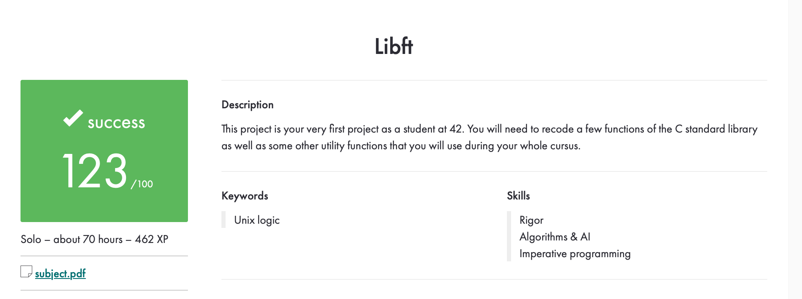

# Libft

Libft è una libreria personalizzata scritta in C che fornisce un insieme di funzioni di utilità per la manipolazione di stringhe, gestione della memoria e operazioni su liste concatenate. Questa libreria è comunemente utilizzata nei progetti della scuola 42 come base per sviluppi successivi.

## 📌 Contenuto
La libreria include diverse categorie di funzioni:  
- Funzioni della libc: implementazioni di funzioni standard come strlen, strcpy, atoi, ecc.
- Gestione della memoria: funzioni per l'allocazione e la manipolazione della memoria (malloc, free, memcpy, ecc.).
- Manipolazione di stringhe: funzioni per la modifica e la ricerca in stringhe.
- Liste concatenate: funzioni per la gestione di liste concatenate (t_list).

## 📁 Struttura del Progetto
```
libft/
├── includes/
│   ├── libft.h
├── srcs/
│   ├── ft_strlen.c
│   ├── ft_strcpy.c
│   ├── ft_memcpy.c
│   ├── ft_atoi.c
│   ├── ...
├── Makefile
├── README.md
```
## 🚀 Installazione e Utilizzo
Per compilare la libreria ed ottenere il file libft.a, eseguire:  
```
make
```
Per pulire i file oggetto generati:
```
make clean
```
Per rimuovere anche la libreria compilata:
```
make fclean
```
Per ricompilare tutto da zero:
```
make re
```
Integrazione in un progetto

Per includere la libreria nel seguente modo:
```
#include "libft.h"
```
E compilarla con:
```
gcc -Wall -Wextra -Werror main.c -L. -lft -o my_program
```
## 📜 Funzioni Implementate

| Categoria | Funzioni |
|-----------|----------|
| **Libc**  | `ft_strlen`, `ft_strcpy`, `ft_strcmp`, `ft_atoi`, ... |
| **Memoria**  | `ft_memset`, `ft_memcpy`, `ft_memmove`, `ft_bzero`, ... |
| **Stringhe** | `ft_strchr`, `ft_strrchr`, `ft_strnstr`, ... |
| **Liste**   | `ft_lstnew`, `ft_lstadd_front`, `ft_lstsize`, ... |

## 🛠 Compilazione e Test

Se vuoi testare la libreria, puoi scrivere dei test in un file separato e compilarlo con:  
```
gcc -Wall -Wextra -Werror test.c libft.a -o test
./test
```
## Votazione

## 📄 Licenza

Progetto realizzato per scopi educativi nell'ambito del curriculum 42. Sviluppato con ❤️

Autore
fmontini - fmontini@student.42.fr
